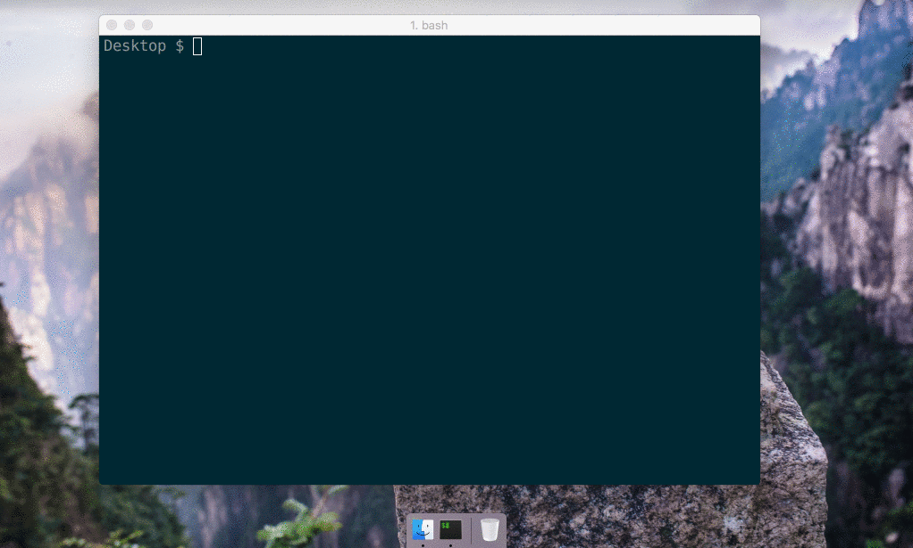

# Nativefier

[](https://travis-ci.org/jiahaog/nativefier)
[](https://www.npmjs.com/package/nativefier)


You want to make a native wrapper for WhatsApp Web (or any web page).

```bash
nativefier web.whatsapp.com
```



You're done.

## Introduction

Nativefier is a command-line tool to easily create a desktop app for any web site
with minimal configuration. Apps are wrapped by [Electron](https://www.electronjs.org/)
(which uses Chromium under the hood) in an OS executable (`.app`, `.exe`, etc)
for use on Windows, macOS and Linux.

I did this because I was tired of having to `⌘-tab` or `alt-tab` to my browser and then search
through the numerous open tabs when I was using [Facebook Messenger](https://messenger.com) or
[Whatsapp Web](https://web.whatsapp.com) ([HN thread](https://news.ycombinator.com/item?id=10930718)). Nativefier features:

- Automatically retrieval of app icon / name.
- JavaScript and CSS injection.
- Many more, see the [API docs](docs/api.md) or `nativefier --help`

## Installation

- macOS 10.9+ / Windows / Linux
- [Node.js](https://nodejs.org/) `>= 10` and npm `>= 6`
- Optional dependencies:
    - [ImageMagick](http://www.imagemagick.org/) to convert icons.
      Make sure `convert` and `identify` are in your system `$PATH`.
    - [Wine](https://www.winehq.org/) to package Windows apps under non-Windows platforms.
      Make sure `wine` is in your `$PATH`.

```bash
npm install nativefier -g
```

## Usage

To create a native desktop app for [medium.com](https://medium.com),
simply  `nativefier "medium.com"`

Nativefier will try to determine the app name, your OS and processor architecture,
among other options. If desired, the app name or other options can be overwritten
by specifying the `--name "Medium"` as part of the command line options:
`nativefier --name "Some Awesome App" "medium.com"`

**Read the [API documentation](docs/api.md) (or `nativefier --help`)**
for other command-line flags usable to configure the packaged app.

To have high-resolution icons used by default for an app/domain, please
contribute to the [icon repository](https://github.com/jiahaog/nativefier-icons)!

Note that the application menu is hidden by default for a minimal UI.
You can press the `alt` keyboard key to access it.

## Development

Help welcome on [bugs](https://github.com/jiahaog/nativefier/issues?q=is%3Aissue+label%3Abug) and
[feature requests](https://github.com/jiahaog/nativefier/issues?q=is%3Aissue+label%3A%22feature+request%22)!

[Developer / build docs](docs/development.md), [API docs](docs/api.md), 
[Changelog](CHANGELOG.md).

## License

[MIT](LICENSE.md)
